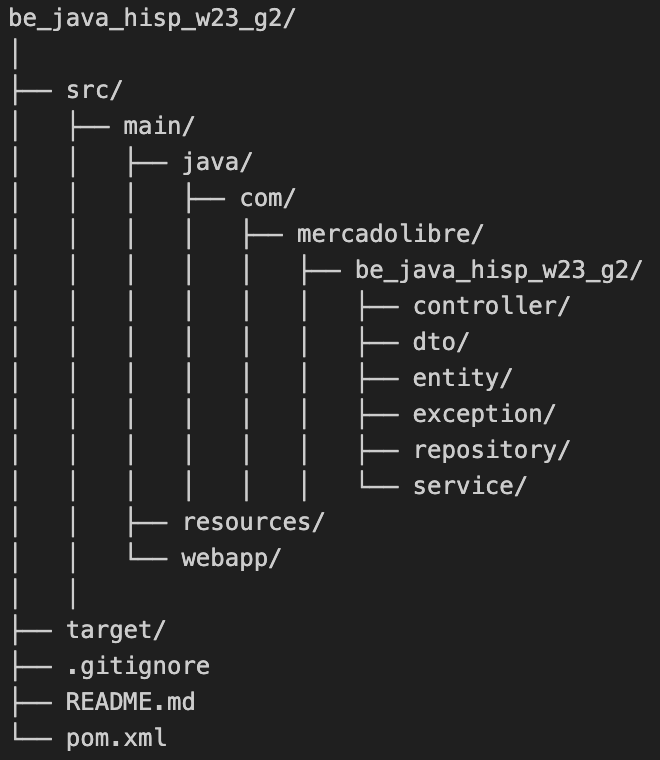

# Name App: SocialMedia

## Resumen

This project is designed to provide a platform for users to connect, follow each other, and share posts. The project is implemented in Java (v17) and Spring Boot.

## Introduction
Mercado Libre continues to grow and next year it aims to begin implementing a series of tools that allow buyers and sellers to have a totally innovative experience, where the bond that unites them is much closer.
The launch date is approaching, which is why it is necessary to present a Beta version of what will be known as “SocialMeli”, where buyers will be able to follow their favorite sellers and find out about all the news that they have.

## Features
- User registration and profile management
- Follow/unfollow other users
- Share posts with followers
- View posts from followed users
- Retrieve followers and followed users
- Count the number of followers for a specific user
- Create a post for a new product on promotion
- Count products on promotion for a specific user

## Endpoints
- [POST US-0001]
  - localhost:8080/users/{userId}/follow/{userIdToFollow}
  - Endpoint perform the “Follow” action to a user
  - Responsible: [Martin Lackington]
- [GET US-0002]
  - localhost:8080/users/{userId}/followers/count
  - Endpoint perform the “Count followers” action to a user
  - Responsible: [Felipe Costa]
- [GET US-0003]
  - localhost:8080/users/{userId}/followers/list
  - Endpoint perform the “List followers” action to a user
  - Responsible: [Felipe Costa]
- [GET US-0004]
  - localhost:8080/users/{userId}/followed/list
  - Endpoint perform the “List followed” action to a user
  - Responsible: [Claudia Vargas]
- [POST US-0005]
  - localhost:8080/products/post
  - Endpoint perform the “Create a Post” action to a user
  - Responsible: [Marcos Costanzo]
- [GET US-0006]
  - localhost:8080/products/followed/{userId}/list
  - Endpoint perform the “List the posts from follwed” action to a user
  - Responsible: [Clauida Vargas]
- [POST US-0007]
  - localhost:8080/users/{userId}/unfollow/{userIdToUnfollow}
  - Endpoint perform the “Unfollow user” action to a user
  - Responsible: [Jannett Aquino]
- [GET US-0008]
  - localhost:8080/users/{UserID}/followers/list?order=name_asc
  - Endpoint perform the “List the followers in alphabetic order” action to a user
  - Responsible: [Hernan De San Vicente]
- [GET US-0009]
  - localhost:8080/products/followed/{userId}/list?order=date_asc
  - Endpoint perform the “List the products from followed in date order” action to a user
  - Responsible: [Hernan De San Vicente]
- [POST US-0010]
  - localhost:8080/products/promo-post
  - Endpoint perform the "Create a post for a new product on promotion"
  - Responsible: [Claudia Vargas]
- [GET US-0011]
  - localhost:8080/products/promo-post/count/user_id={userId}
  - Endpoint perform the “Count products on promotion” of a user
  - Responsible: [Claudia Vargas]
- [GET US-0012]
  - localhost:8080/products/promo-post/list/category={category}
  - Endpoint perform the “List products on promotion by specific category”

## Technologies Used
- Java
- Spring Boot
- Maven
- JSON (for data storage)

## Project Structure

## Getting Started
Follow these steps to set up the project on your local machine.

### Prerequisites
Make sure you have the following installed:

Java (version 17)
Maven (version 3.9.5)

### Installation

### Clone the repository:
- git clone

### Build the project:
mvn clean install

### Run the application:
mvn spring-boot:run

### PostMan Collection
Path: [PostManCollection](src/main/resources/Sprint%201.postman_collection.json)

### Technical specifications
Path: [TechnicalSpecifications](src/main/resources/Esp.ReqTecnicosFuncionalesSprint1.docx)

### Integers:
- Claudia Vargas

### Gratitude:

- **[Equipo 2]:** I thank my team for all the help and commitment they provided for the development of the app as a group

